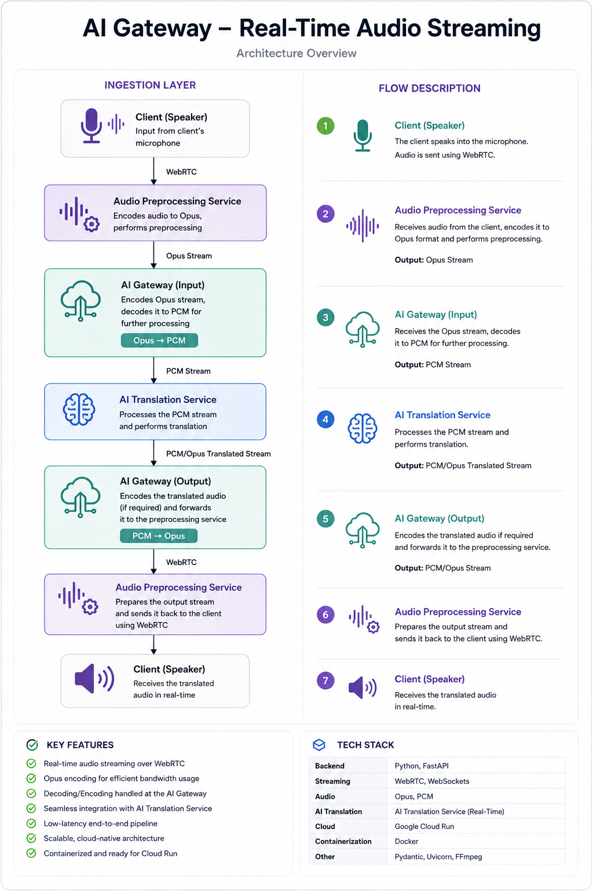
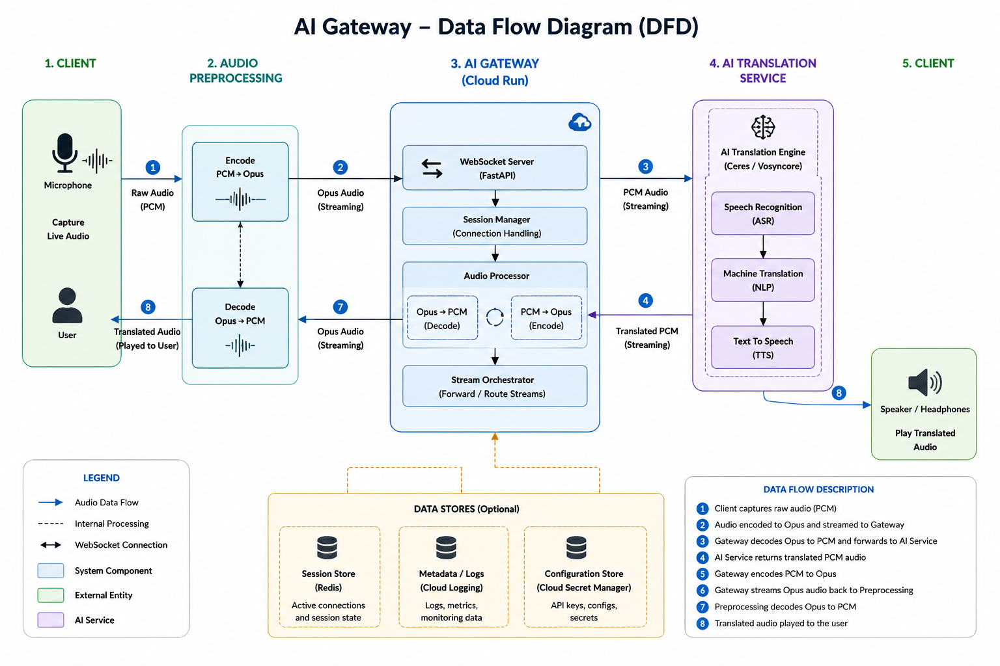
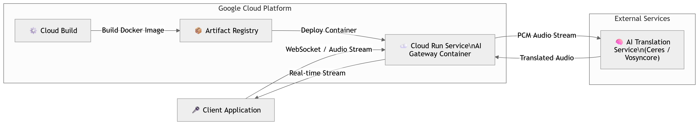

# 🎙️ AI Gateway – Real-Time Audio Streaming

**A cloud-native AI Gateway for low-latency multilingual audio streaming built with Python, FastAPI, WebSockets, Docker, and Google Cloud Run.**

---

# 📑 Table of Contents

- [Project Overview](#-project-overview)
- [Project Goals](#-project-goals)
- [Key Features](#-key-features)
- [System Architecture](#-system-architecture)
- [Architecture Overview](#-architecture-overview)
- [Data Flow](#-data-flow)
- [Cloud Run Deployment](#-cloud-run-deployment)
- [System Workflow](#-system-workflow)
- [Technology Stack](#-technology-stack)
- [Repository Structure](#-repository-structure)
- [Getting Started](#-getting-started)
- [Docker](#-docker)
- [Deploy to Google Cloud Run](#-deploy-to-google-cloud-run)
- [Project Roadmap](#-project-roadmap)
- [Future Improvements](#-future-improvements)
- [Contributing](#-contributing)
- [License](#-license)
- [Author](#-author)

---

# 📖 Project Overview

AI Gateway is a cloud-native backend service designed for real-time multilingual audio streaming with extremely low latency.

The gateway acts as the central orchestration layer between client applications and AI-powered speech services. It receives live audio streams over WebSockets, performs real-time audio transcoding, forwards audio to external AI services, and streams translated audio back to clients with minimal latency.

The application follows modern cloud-native engineering principles by leveraging:

- Asynchronous programming with FastAPI
- Persistent WebSocket communication
- Stateless service architecture
- Docker containerization
- Google Cloud Run serverless deployment
- Horizontal scalability

This project demonstrates production-oriented backend engineering practices for building scalable AI communication systems.

---

# 🎯 Project Goals

The primary objectives of this project are to:

- Enable real-time multilingual voice communication
- Deliver ultra-low latency audio streaming
- Build a cloud-native backend service
- Demonstrate asynchronous WebSocket communication
- Support scalable containerized deployments
- Showcase modern backend architecture on Google Cloud Platform

---

# ✨ Key Features

- 🎤 Real-time audio streaming
- 🌍 AI-powered multilingual translation
- ⚡ Low end-to-end latency
- 🔄 Opus ↔ PCM audio transcoding
- 📡 Full-duplex WebSocket communication
- ☁️ Serverless deployment with Google Cloud Run
- 🐳 Docker containerization
- 📈 Stateless and horizontally scalable architecture
- 🚀 Production-ready cloud-native backend
- 🔌 Easy integration with external AI services

---

# 🏗️ System Architecture

  

---

# 🏛️ Architecture Overview

The solution is composed of four main layers that work together to provide low-latency multilingual audio streaming.

## 🎤 Client Layer

The client application is responsible for:

- Capturing microphone audio
- Encoding audio frames
- Streaming audio over WebSockets
- Receiving translated audio
- Playing translated speech in real time

---

## 🎧 Audio Processing Layer

This layer prepares audio before it reaches the AI services.

Responsibilities include:

- Audio buffering
- Frame management
- Opus encoding
- Opus decoding
- PCM conversion

---

## ☁️ AI Gateway

The AI Gateway is the core component of the system.

Its responsibilities include:

- Managing WebSocket connections
- Session lifecycle management
- Audio transcoding (Opus ↔ PCM)
- Request routing
- Stream synchronization
- Error handling
- Communication with external AI services
- Returning translated audio to connected clients

The gateway is designed as a stateless service, allowing Cloud Run to scale instances automatically based on incoming traffic.

---

## 🧠 External AI Services

The gateway communicates with external AI services responsible for:

- Speech recognition
- Speech translation
- Speech synthesis
- Returning translated audio streams

Because the gateway is loosely coupled to AI providers, different speech services can be integrated without modifying the gateway architecture.

---

# 🔄 Data Flow

  

---

# 📡 Data Flow Overview

The audio pipeline follows these steps:

1. The client captures microphone audio.
2. Audio is encoded using the Opus codec.
3. Audio frames are streamed to the AI Gateway through WebSockets.
4. The gateway decodes Opus into PCM.
5. PCM audio is forwarded to the external AI translation service.
6. The AI service performs speech recognition, translation, and speech synthesis.
7. Translated PCM audio is returned to the gateway.
8. The gateway re-encodes PCM into Opus.
9. The translated stream is sent back to the client.
10. The client plays the translated speech in real time.

---

# ☁️ Cloud Run Deployment

  

---

# 🚀 Deployment Architecture

The AI Gateway is packaged as a Docker container and deployed on Google Cloud Run using a fully serverless architecture.

### Deployment Pipeline

1. Source code is packaged into a Docker image.
2. Google Cloud Build builds the container image.
3. The image is stored in Google Artifact Registry.
4. Google Cloud Run deploys immutable container revisions.
5. Incoming traffic is automatically routed to healthy service instances.

### Runtime Execution

Once deployed:

- Clients establish persistent WebSocket connections.
- Cloud Run automatically creates new instances based on incoming traffic.
- Each instance processes audio streams independently.
- Audio is securely exchanged with external AI services.
- Responses are streamed back to clients with minimal latency.

### Benefits

- Fully serverless infrastructure
- Automatic horizontal scaling
- High availability
- Stateless architecture
- Simplified deployment
- Pay-per-use pricing model
- Zero server management
