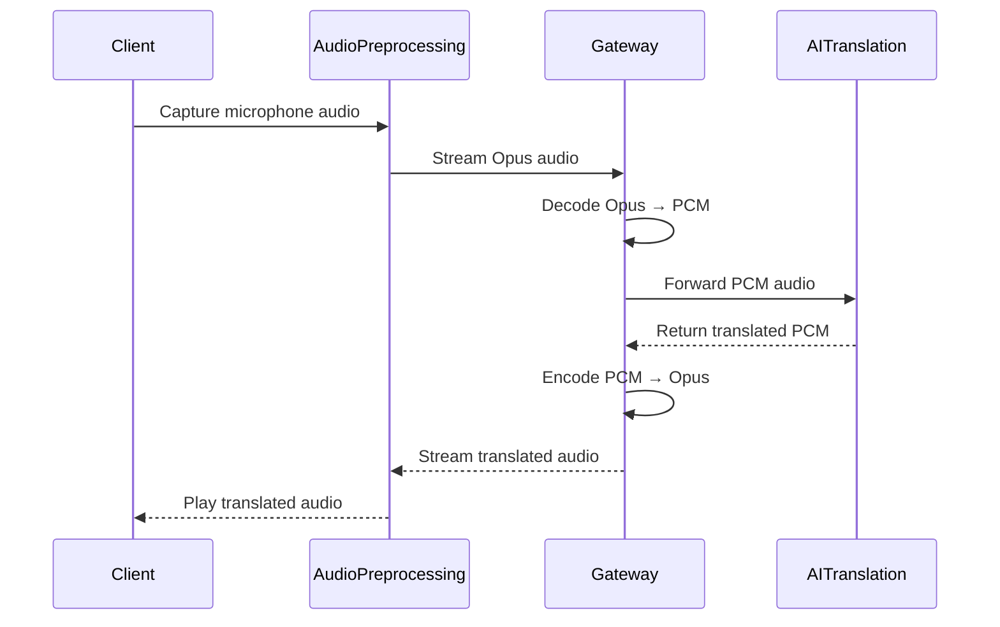

# 🎙️ AI Gateway – Real-Time Audio Streaming

<p align="center">

**A cloud-native AI Gateway for low-latency multilingual audio streaming built with Python, FastAPI, WebSockets, Docker, and Google Cloud Run.**

</p>

<p align="center">


</p>

---

# 📑 Table of Contents

- [Project Overview](#-project-overview)
- [Project Goals](#-project-goals)
- [Key Features](#-key-features)
- [System Architecture](#-system-architecture)
- [Architecture Overview](#-architecture-overview)
- [Data Flow](#-data-flow)
- [Cloud Run Deployment](#-cloud-run-deployment)
- [System Workflow](#-system-workflow)
- [Technology Stack](#-technology-stack)
- [Repository Structure](#-repository-structure)
- [Getting Started](#-getting-started)
- [Docker](#-docker)
- [Deploy to Google Cloud Run](#-deploy-to-google-cloud-run)
- [Project Roadmap](#-project-roadmap)
- [Future Improvements](#-future-improvements)
- [Contributing](#-contributing)
- [License](#-license)
- [Author](#-author)

---

# 📖 Project Overview

AI Gateway is a cloud-native backend service designed for real-time multilingual audio streaming with extremely low latency.

The gateway acts as the central orchestration layer between client applications and AI-powered speech services. It receives live audio streams over WebSockets, performs real-time audio transcoding, forwards audio to external AI services, and streams translated audio back to clients with minimal latency.

The application follows modern cloud-native engineering principles by leveraging:

- Asynchronous programming with FastAPI
- Persistent WebSocket communication
- Stateless service architecture
- Docker containerization
- Google Cloud Run serverless deployment
- Horizontal scalability

This project demonstrates production-oriented backend engineering practices for building scalable AI communication systems.

---

# 🎯 Project Goals

The primary objectives of this project are to:

- Enable real-time multilingual voice communication
- Deliver ultra-low latency audio streaming
- Build a cloud-native backend service
- Demonstrate asynchronous WebSocket communication
- Support scalable containerized deployments
- Showcase modern backend architecture on Google Cloud Platform

---

# ✨ Key Features

- 🎤 Real-time audio streaming
- 🌍 AI-powered multilingual translation
- ⚡ Low end-to-end latency
- 🔄 Opus ↔ PCM audio transcoding
- 📡 Full-duplex WebSocket communication
- ☁️ Serverless deployment with Google Cloud Run
- 🐳 Docker containerization
- 📈 Stateless and horizontally scalable architecture
- 🚀 Production-ready cloud-native backend
- 🔌 Easy integration with external AI services

---

# 🏗️ System Architecture

<p align="center">
  
</p>

---

# 🏛️ Architecture Overview

The solution is composed of four main layers that work together to provide low-latency multilingual audio streaming.

## 🎤 Client Layer

The client application is responsible for:

- Capturing microphone audio
- Encoding audio frames
- Streaming audio over WebSockets
- Receiving translated audio
- Playing translated speech in real time

---

## 🎧 Audio Processing Layer

This layer prepares audio before it reaches the AI services.

Responsibilities include:

- Audio buffering
- Frame management
- Opus encoding
- Opus decoding
- PCM conversion

---

## ☁️ AI Gateway

The AI Gateway is the core component of the system.

Its responsibilities include:

- Managing WebSocket connections
- Session lifecycle management
- Audio transcoding (Opus ↔ PCM)
- Request routing
- Stream synchronization
- Error handling
- Communication with external AI services
- Returning translated audio to connected clients

The gateway is designed as a stateless service, allowing Cloud Run to scale instances automatically based on incoming traffic.

---

## 🧠 External AI Services

The gateway communicates with external AI services responsible for:

- Speech recognition
- Speech translation
- Speech synthesis
- Returning translated audio streams

Because the gateway is loosely coupled to AI providers, different speech services can be integrated without modifying the gateway architecture.

---

# 🔄 Data Flow

<p align="center">
  
</p>

---

# 📡 Data Flow Overview

The audio pipeline follows these steps:

1. The client captures microphone audio.
2. Audio is encoded using the Opus codec.
3. Audio frames are streamed to the AI Gateway through WebSockets.
4. The gateway decodes Opus into PCM.
5. PCM audio is forwarded to the external AI translation service.
6. The AI service performs speech recognition, translation, and speech synthesis.
7. Translated PCM audio is returned to the gateway.
8. The gateway re-encodes PCM into Opus.
9. The translated stream is sent back to the client.
10. The client plays the translated speech in real time.

---

# ☁️ Cloud Run Deployment

<p align="center">
  
</p>

---

# 🚀 Deployment Architecture

The AI Gateway is packaged as a Docker container and deployed on Google Cloud Run using a fully serverless architecture.

### Deployment Pipeline

1. Source code is packaged into a Docker image.
2. Google Cloud Build builds the container image.
3. The image is stored in Google Artifact Registry.
4. Google Cloud Run deploys immutable container revisions.
5. Incoming traffic is automatically routed to healthy service instances.

### Runtime Execution

Once deployed:

- Clients establish persistent WebSocket connections.
- Cloud Run automatically creates new instances based on incoming traffic.
- Each instance processes audio streams independently.
- Audio is securely exchanged with external AI services.
- Responses are streamed back to clients with minimal latency.

### Benefits

- Fully serverless infrastructure
- Automatic horizontal scaling
- High availability
- Stateless architecture
- Simplified deployment
- Pay-per-use pricing model
- Zero server management

---

# 🔄 System Workflow

The following sequence diagram illustrates how audio is processed from the client to the AI service and back in real time.



---

# ⚙️ Technology Stack

| Category | Technology |
|------------|------------|
| Programming Language | Python 3.11 |
| Backend Framework | FastAPI |
| Communication | WebSockets |
| Audio Codec | Opus |
| Audio Format | PCM |
| Streaming | WebRTC |
| Containerization | Docker |
| Cloud Platform | Google Cloud Platform |
| Deployment | Google Cloud Run |
| Container Registry | Artifact Registry |
| Build Service | Google Cloud Build |
| Architecture | Cloud Native |
| Concurrency | AsyncIO |
| API Protocol | REST + WebSockets |

---

# 📂 Repository Structure

```text
ai-gateway-real-time-streaming/
│
├── diagrams/
│   ├── architecture.png
│   ├── cloud_run_deployment.png
│   └── data_flow.png
│
├── docs/
│   ├── architecture.md
│   ├── deployment.md
│   ├── api.md
│   └── troubleshooting.md
│
├── src/
│   ├── api/
│   ├── audio/
│   ├── gateway/
│   ├── services/
│   ├── utils/
│   └── main.py
│
├── tests/
│
├── Dockerfile
├── docker-compose.yml
├── requirements.txt
├── README.md
└── LICENSE
```

---

# 🚀 Getting Started

## Prerequisites

Before running this project, make sure you have installed:

- Python 3.11 or later
- Git
- Docker Desktop
- Google Cloud SDK (optional for deployment)
- A Google Cloud Project
- Google Cloud Run enabled

---

## Clone the Repository

```bash
git clone https://github.com/ArielleSedoine/ai-gateway-real-time-streaming.git

cd ai-gateway-real-time-streaming
```

---

## Create a Virtual Environment

### Windows

```bash
python -m venv .venv

.venv\Scripts\activate
```

### Linux / macOS

```bash
python3 -m venv .venv

source .venv/bin/activate
```

---

## Install Dependencies

```bash
pip install --upgrade pip

pip install -r requirements.txt
```

---

## Project Configuration

If environment variables are required, create a `.env` file.

Example:

```env
HOST=0.0.0.0
PORT=8080
LOG_LEVEL=INFO
```

---

## Run the Application

```bash
python src/main.py
```

The API will be available at:

```
http://localhost:8080
```

---

# 🐳 Docker

## Build the Docker Image

```bash
docker build -t ai-gateway .
```

---

## Run the Container

```bash
docker run -p 8080:8080 ai-gateway
```

The application will be accessible at:

```
http://localhost:8080
```

---

## Verify Running Containers

```bash
docker ps
```

---

## Stop the Container

```bash
docker stop <container_id>
```

---

# ☁️ Deploy to Google Cloud Run

## Step 1 — Authenticate

```bash
gcloud auth login
```

---

## Step 2 — Select Your Project

```bash
gcloud config set project verse-dev-433901
```

---

## Step 3 — Build the Container Image

```bash
gcloud builds submit --tag gcr.io/verse-dev-433901/ai-gateway
```

---

## Step 4 — Deploy to Cloud Run

```bash
gcloud run deploy ai-gateway-up01 \
    --image gcr.io/verse-dev-433901/ai-gateway \
    --platform managed \
    --region us-east4 \
    --allow-unauthenticated
```

---

## Step 5 — Access the Service

After deployment, Google Cloud Run generates a public HTTPS endpoint similar to:

```
https://ai-gateway-xxxxxxxx-uc.a.run.app/health
```

Clients can establish secure WebSocket connections using this endpoint.

---

# 📊 Deployment Highlights

The deployment architecture provides:

- Fully managed serverless infrastructure
- Automatic horizontal scaling
- Zero server maintenance
- Stateless service deployment
- High availability
- Secure HTTPS endpoints
- Pay-per-use pricing
- Seamless Docker integration

---

# 📈 Project Roadmap

The project will continue evolving with new capabilities and cloud-native improvements.

## Core Features

- [x] Real-time audio streaming
- [x] Full-duplex WebSocket communication
- [x] Opus ↔ PCM audio transcoding
- [x] FastAPI asynchronous backend
- [x] Docker containerization
- [x] Google Cloud Run deployment
- [x] Cloud-native architecture

---

## Planned Features

- [ ] Authentication and authorization
- [ ] Session management
- [ ] Automatic reconnection
- [ ] Multiple concurrent streaming sessions
- [ ] Voice Activity Detection (VAD)
- [ ] Audio quality optimization
- [ ] Configurable audio codecs
- [ ] Streaming metrics dashboard

---

## DevOps

- [ ] GitHub Actions CI/CD
- [ ] Automated Docker image builds
- [ ] Continuous deployment to Cloud Run
- [ ] Infrastructure as Code (Terraform)
- [ ] Environment configuration management

---

## Monitoring & Observability

- [ ] Cloud Logging integration
- [ ] Cloud Monitoring dashboards
- [ ] Prometheus metrics
- [ ] Grafana dashboards
- [ ] Distributed tracing
- [ ] Error reporting

---

## Testing

- [ ] Unit tests
- [ ] Integration tests
- [ ] End-to-end tests
- [ ] Performance benchmarking
- [ ] Load testing
- [ ] Stress testing

---

## Scalability

- [ ] Horizontal autoscaling optimization
- [ ] Session affinity
- [ ] Multi-region deployment
- [ ] High availability improvements
- [ ] Fault tolerance strategies

---

# 💡 Future Improvements

Future versions of AI Gateway may include:

- AI model selection at runtime
- Support for multiple AI providers
- Automatic language detection
- Speech emotion recognition
- Speaker identification
- Real-time subtitles
- Audio recording
- Persistent session storage
- WebRTC optimization
- Kubernetes deployment (GKE) + Load Balancer
- Multi-cloud deployment
- Advanced observability
- Distributed caching
- Rate limiting
- API versioning

---

# 🎯 Use Cases

AI Gateway can serve as the backend foundation for applications such as:

- 🌍 Real-time multilingual communication
- 🎧 Live audio translation
- 🤖 AI-powered voice assistants
- 📞 Contact center solutions
- 🎙️ Voice-enabled AI applications
- 🎓 Online learning platforms
- 🏥 Telemedicine communication
- 💼 International business meetings
- 🎮 Multiplayer voice communication
- 📡 Real-time speech processing platforms

---

# 📊 System Characteristics

| Property | Description |
|----------|-------------|
| Architecture | Cloud Native |
| Backend | Asynchronous FastAPI |
| Communication | Full-duplex WebSockets |
| Deployment | Google Cloud Run |
| Containerization | Docker |
| Scalability | Horizontal |
| Infrastructure | Serverless |
| Audio Pipeline | Streaming |
| Latency | Low |
| Design | Stateless |

---

# 🤝 Contributing

Contributions are welcome.

If you would like to improve this project, feel free to:

1. Fork the repository.
2. Create a feature branch.
3. Commit your changes.
4. Push your branch.
5. Open a Pull Request.

Bug reports, feature requests, and suggestions are always appreciated.

---

# 📄 License

This project is licensed under the MIT License.

See the **LICENSE** file for more information.

---

# 👩🏾‍💻 Author

## Arielle Sedoine

**Software Engineer | Cloud Engineer | Backend Developer**

Passionate about building scalable cloud-native systems, distributed backend services, and AI-powered applications.

### Connect with me

📧 **Email**

notouom777@gmail.com

💼 **LinkedIn**

https://www.linkedin.com/in/arielle-60178832a/

🐙 **GitHub**

https://github.com/ArielleSedoine

---

# ⭐ Support the Project

If you found this project useful or interesting:

- ⭐ Star this repository
- 🍴 Fork the project
- 🐛 Report issues
- 💡 Suggest new features
- 🤝 Contribute improvements

Your support helps improve the project and encourages future development.

---

<p align="center">

Made with ❤️ using Python, FastAPI, Docker and Google Cloud Run.

</p>
